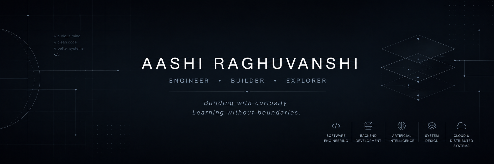

###

  

## About

**I'm fascinated by the ideas behind technology as much as the technology itself.**

Whether it's software architecture, artificial intelligence, distributed systems, or an entirely unfamiliar technology, I enjoy understanding *why* things work before deciding *how* to build them.

Rather than limiting myself to a single domain, I'm always looking for the next concept that changes the way I think.

I believe great engineers aren't defined by the tools they know but by their ability to learn, adapt, and solve problems across disciplines.

---

## Interests

`Software Engineering` • `Backend Development` • `System Design`

`Artificial Intelligence` • `Machine Learning`

`Cloud Computing` • `Distributed Systems` • `Databases`

`Developer Experience` • `Open Source`

---

